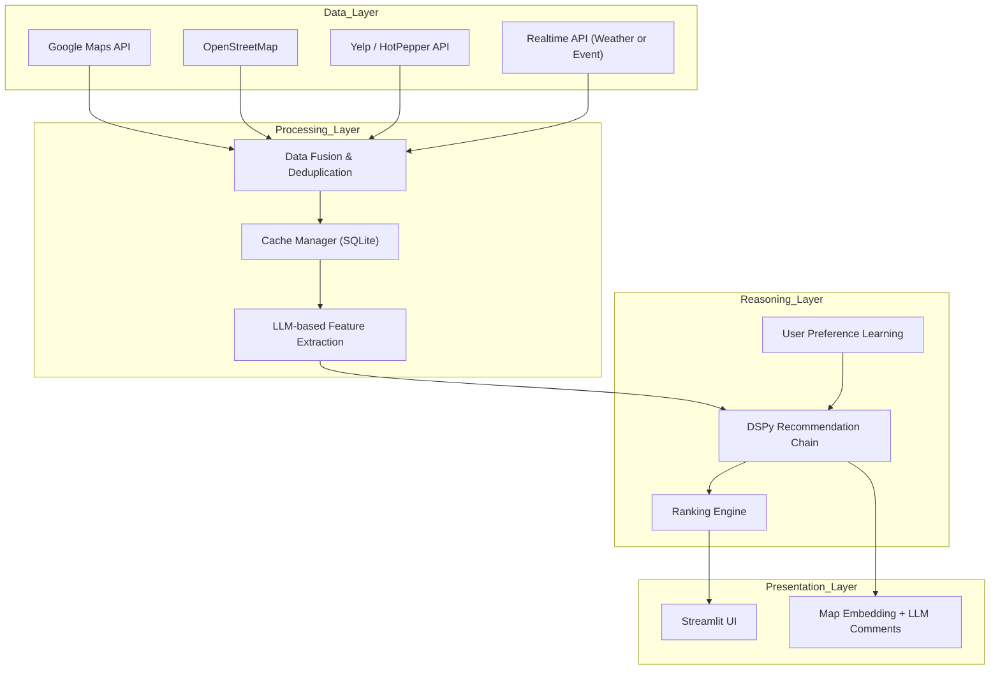

## todo list
- [☑️] .env, config.yamlの設定
- [☑️] google_maps.pyの実装
- [☑️] Streamlit.pyによる実装
PYTHONPATH=. uv run streamlit run src/app/app.py
- [☑️] DSPyの実装
- [☑️] ローカルLLMで自然文章の生成
### 差別化戦略
- [ ] 会話的インターフェイスの実装（状態を保持して、前回の結果に基づくクエリを生成）
- [ ] 提示する情報の拡充（レビュー評価、営業時間、写真など）
- [ ] マルチプロバイダ対応（OpenStreetMap, HERE, Yelp, HotPepperなど）
- [ ] カフェドメインに特化した属性を追加

## google_maps.py
- [ ] カフェ検索精度の向上
    - [☑️] keywordパラメータの追加実装（user_queryとして入力に追加する）
    - [ ] APIレスポンス内容の拡充
        - [ ] 住所、営業時間、レビュー評価、写真、公式サイトリンク、席数など 
    - [ ] タグによる検索ができるようにする
        - Wi-fiあり、電源あり、ペット可、テラス席あり、雰囲気が良いなどのタグを選択できるようにする
- [☑️] カフェ詳細情報の選定
    - detail_get_details関数で取得するように修正した

## dspy/
### modules.py
- [ ] DSPyモジュールによる最適化
- [ ] 口コミの要約機能の追加
- [ ] Wi-fiの有無の情報取得機能の追加
### signatures.py
- [ ] 設定しているシグネチャの見直しと最適化

## local_llm.py
- [☑️] キャッシュ機能の追加
- [ ] キャッシュがない場合のみLLMを呼び出すように変更する
- [ ] プロンプト最適化
- [ ] ローカルLLMのモデル選定（Gemma3：12bだと少し時間がかかります。）
| 優先度                           | モデル名               | 特徴                                    | 理由 |
| :---------------------------- | :----------------- | :------------------------------------ | :- |
| 🥇 **`mistral:instruct`（7B）** | 高速・軽量・英日バランス良      | M4のCPU/GPUでも余裕。会話・推薦文生成が自然。DSPyとの相性◎  |    |
| 🥈 **`llama3:8b-instruct`**   | 精度・流暢さ・指示順守性がさらに良い | 24GBメモリで動作可能（やや遅くなるが実用範囲）。多言語に強く自然。   |    |
| 🥉 **`phi3:mini`（3.8B）**      | 超軽量で速い             | 試作やモバイル開発用に最適。ただし文生成は少し硬い。            |    |
| 🎌 **`elyza:7b-instruct`**    | 日本語最適化             | 完全日本語対応。カフェBotが日本語メインなら有力候補。M4上でも実行可。 |    |

## app.py
### 追加機能
- [☑️] 検索結果のカフェ情報を地図上にマーカーで表示する機能を追加する。
    - 駅から何分なのかも表示できると良い
- [ ] 詳細情報を表示するための機能追加
    - get_place_details関数を呼び出し、口コミの要約と、Wi-fiの有無について表示できるようにする。
- カフェを探すためのインターフェースを改善する。
    - 位置情報の手動入力（住所、ランドマーク名など）を可能にする。
    - 検索範囲（例：500m、1km、5kmなど）を選択できるようにする。
- カフェの特徴やおすすめスポットを表示するためのセクションを追加する。
- カフェの設備ごとに検索できるようにしたい。
    - Wi-fiあり、電源あり、ペット可、テラス席あり、雰囲気が良いなどのタグを選択できるようにする

